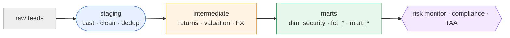

# duck-warehouse — a dbt-style analytics warehouse on DuckDB

[](https://github.com/jxgeraghty-dotcom/duck-warehouse/actions/workflows/ci.yml)
[](LICENSE)
[](pyproject.toml)

A small, dependency-light data platform that models raw investment feeds into
clean, tested, documented marts — and hands those marts to the other tools in
this portfolio in exactly the shape each one expects.

It is deliberately the **connective tissue** of the collection rather than a
standalone app: the same security master, returns, holdings, benchmark and
factor tables produced here are what the
[portfolio risk & exposure monitor](#what-it-feeds), the
[guideline & compliance engine](#what-it-feeds) and the
[multi-asset TAA backtester](#what-it-feeds) consume. Building it on a local
DuckDB file with a dbt-style project stands in credibly for the same modelling
you would do on Snowflake or Databricks — sources, staging, marts, tests,
lineage, and a data-quality surface — without the cloud account.

> **TL;DR**
> ```bash
> pip install -e .
> dw build --generate     # generate sample feeds, build all models, run every test
> dw export               # write consumer-shaped CSVs for the sibling tools
> ```

---

## Why this exists

Every other project in the portfolio starts from a CSV someone had to produce.
This one is that producer. It demonstrates the part of an investment-data job
that is usually invisible in a finished model: **turning messy upstream feeds
into trustworthy, versioned, tested tables**, and being able to prove the data
is clean. That maps directly to "continuous improvement of data
infrastructure" — new sources, new tests, and new marts are additive, and the
DAG + test suite keep the whole thing honest as it grows.

Rather than install `dbt`, the project re-implements the handful of ideas that
make dbt valuable, in ~700 lines of readable Python. That is intentional: it
shows the mechanics (ref/source resolution, a compiled DAG, layered
materialisation, schema + data tests) rather than hiding them behind a tool.

## The mini-dbt framework

`dw` is a tiny ELT engine. It understands these templating constructs inside a
model's SQL:

| Construct | Resolves to | Purpose |
| --- | --- | --- |
| `{{ source('raw', 'prices') }}` | `raw.prices` | a raw seed table |
| `{{ ref('stg_prices') }}` | `main.stg_prices` | another model (creates a DAG edge) |
| `{{ config(materialized='table') }}` | — | per-model view/table/incremental override |
| `{{ this }}` | the model's own relation | self-reference for incremental filters |
| ` … ` | kept only when appending | incremental-only SQL |

From those it builds a dependency graph, topologically sorts it, and runs each
model as `CREATE OR REPLACE {VIEW|TABLE}` (or `INSERT` for incremental appends)
in order. Tests are declared in `schema.yml` (generic tests, on models *and*
sources) or written as SQL files under `data_tests/` (singular tests); each
compiles to a query that must return zero failing rows and carries a `severity`
(`error` or `warn`). Node **selection** (`dw run --select stg_prices+`),
**incremental** models, and source **freshness** SLAs round out the dbt-shaped
feature set.

## Architecture

Three layers, following the standard staging → intermediate → marts pattern:

- **staging** (`stg_*`, views): one model per source. All casting and cleaning
  lives here — trimming keys, recovering blank fields, normalising ratings and
  currencies, nulling bad prices. Nothing downstream re-cleans.
- **intermediate** (`int_*`, views): reusable business logic that isn't a final
  product — computing returns from prices, valuing positions and converting to
  USD.
- **marts** (`dim_*` / `fct_*` / `mart_*`, tables): the conformed, documented
  outputs the downstream tools query.



The full model-level lineage is generated to
[`reports/dag.md`](reports/dag.md) and the annotated catalog (descriptions,
tests, row counts) to [`reports/catalog.md`](reports/catalog.md) by `dw docs`.

## The data

`dw seed --generate` produces eight raw feeds (deterministic, fixed RNG seed) for
a ~40-instrument multi-asset universe of equities, corporate and government
bonds, and cash across three regions and four currencies, with 36 monthly
snapshots:

`security_master` · `prices` · `holdings` · `benchmark` · `factor_returns` ·
`factor_exposures` · `macro` · `fx_rates`

The raw data is **deliberately messy**, and each defect is repaired by a
specific staging transformation and then guarded by a test:

| Injected defect (raw) | Repaired by | Proven by |
| --- | --- | --- |
| duplicate `EQ001` re-sent with a leading space | trim + `row_number()` de-dup | `unique` test on `dim_security.security_id` |
| blank `asset_class` on `EQ007` | recover from the id prefix | `not_null` + `accepted_values` |
| rating `' bbb '` on `CB003` | trim + upper-case | `accepted_values` |
| currency `'eur'` on `EQ010` | upper-case | `accepted_values` + `assert_price_currency_matches_master` |
| a negative price and a blank price | set non-positive/blank → NULL | `assert_no_nonpositive_prices` |
| benchmark weights summing to ~1.03 | re-based in `fct_benchmark_weights` | `assert_benchmark_weights_sum_to_one` |

## What it feeds

`dw export` writes each mart to `exports/` in the exact schema a sibling tool
already reads:

| Export file | Consumer | Contents |
| --- | --- | --- |
| `security_master.csv` | Portfolio risk & exposure monitor | instrument reference data |
| `portfolio_weights.csv` | Portfolio risk & exposure monitor | active weights (ACC-MULTI) |
| `benchmark_weights.csv` | Portfolio risk & exposure monitor | benchmark weights (GLOBAL-60-40) |
| `factor_returns.csv` | Portfolio risk & exposure monitor | factor return time series |
| `factor_covariance.csv` | Portfolio risk & exposure monitor | annualised factor covariance/correlation matrix |
| `compliance_portfolio.csv` | Guideline & compliance engine | valued positions (`security_id,issuer,sector,asset_class,market_value,rating,duration,currency`) |
| `asset_class_index.csv` | Multi-asset TAA backtester | market-value-weighted asset-class total-return indices |
| `macro.csv` | Multi-asset TAA backtester | macro series (yields, spreads, CPI), wide |

`scripts/handoff_smoke.py` closes the loop: it exports every file and then loads
each one back through DuckDB under the consuming tool's expected column types,
failing if any export is missing, mis-shaped, or won't parse. CI runs it on
every push, so a mart change that would break a downstream tool fails here first.

## Quickstart

```bash
# from this directory
python -m venv .venv && source .venv/Scripts/activate   # Windows Git Bash
pip install -e .[dev]

dw build --generate      # generate feeds -> build models -> run all tests -> write docs
dw export                # write the consumer CSVs
pytest                   # run the framework + data test suite
```

No arguments are needed after the first `--generate`; the seed CSVs are checked
in, so `dw build` alone rebuilds from them.

## Command reference

| Command | Does |
| --- | --- |
| `dw seed [--generate]` | load raw CSVs into the `raw` schema (optionally regenerate them first) |
| `dw run [--select … --exclude … --full-refresh]` | build models in DAG order, or a selected subgraph |
| `dw test [--select … --store-failures]` | run schema + source + data tests; non-zero exit on any error |
| `dw build [--generate --full-refresh]` | seed + run + test + docs — the one-shot demo |
| `dw source freshness` | flag feeds whose newest row is older than their SLA |
| `dw export` | write consumer-shaped CSVs to `exports/` |
| `dw docs` | write the lineage graph and model catalog to `reports/` |
| `dw dag` | print the build order and write the Mermaid lineage |
| `dw compile <model>` | print a model's fully-resolved SQL |
| `dw preview <relation> [--limit N]` | show rows from any table/view |

Every command accepts `--project /path/to/dw.yaml` to run against a different
project file.

### Node selection

`--select` / `--exclude` take the core dbt graph operators, so you can rebuild
just the part of the DAG you are working on instead of everything:

```bash
dw run --select stg_prices+          # stg_prices and everything downstream
dw run --select +mart_asset_class_prices   # that mart and everything it needs
dw run --exclude mart_data_quality   # everything except this model
dw test --select dim_security        # only the tests on dim_security
```

### Incremental models & freshness

`fct_security_returns` is materialised **incrementally** with a
`delete+insert` strategy: the first build loads the full history; later runs
reprocess only months `>=` the newest month stored, replacing those rows by
`unique_key` — so new months append *and* a restated price in the newest
stored month is picked up rather than silently ignored. A plain `append`
strategy (INSERT only) is also available, and `dw run --full-refresh` forces
a rebuild. `dw source freshness` compares each
feed's newest `as_of_date` against the `warn_after_days` / `error_after_days`
policy in `dw.yaml` — the guardrail that catches a stalled feed before it
produces a silently wrong number.

## Testing & data quality

Two complementary layers, both run by `dw test` and by `pytest`:

- **51 declared tests** — generic (`not_null`, `unique`, `accepted_values`,
  `relationships`) on models *and* on raw sources, plus eight singular
  business-rule tests in `data_tests/` (weights sum to one, no non-positive
  prices, returns within bounds, factor covariance symmetric, every non-USD
  position has an FX rate on its valuation date, price currency matches the
  security master, and a
  `severity: warn` check that no active instrument is past maturity).
  Failing tests can be materialised with `dw test --store-failures` (offending
  rows written to `reports/failures/`) so a red test is debuggable, not just a
  count. A failing `warn` test is reported but does not break the build.
- **`mart_data_quality`** — an always-on observability table (freshness,
  completeness, integrity) you would trend or alert on in production:

  ```
  securities_total            40   instruments in dim_security
  securities_unrated          21   equities/cash with no rating
  prices_cleaned_to_null       2   bad/missing marks caught by cleaning
  price_history_months        36   monthly snapshots
  benchmark_weight_max_error   0   deviation of any benchmark from weight-sum 1.0
  accounts_total               2   accounts valued
  aum_usd_millions         150.7   total valued AUM (multi-currency, USD)
  ```

The `pytest` suite additionally asserts the *framework* itself is correct
(templating, DAG ordering, cycle detection) and that the injected defects are
actually repaired end-to-end.

## Design choices & trade-offs

- **DuckDB + a hand-rolled runner instead of dbt.** Keeps the dependency
  footprint to `duckdb` + `pyyaml`, runs anywhere with no profiles/adapters, and
  makes the modelling mechanics legible. It implements the dbt ideas that carry
  the most weight — ref/source/config templating, a compiled DAG, node
  selection, layered + incremental materialisation, schema/source/data tests
  with severities, and source freshness. What it intentionally leaves out
  (snapshots/SCD, full Jinja macros, a warehouse adapter) is listed under
  [Extending](#extending).
- **Raw seeds loaded as all-varchar.** The `raw` layer preserves whatever the
  feed sent (blanks, negatives, whitespace); every cast is explicit in staging,
  where it is visible and testable.
- **Marts are tables, staging/intermediate are views.** Downstream tools read
  materialised marts (fast, stable), while the cheap upstream transforms stay as
  views that recompute on demand.
- **Deterministic sample data.** A fixed RNG seed makes the CSVs reproducible and
  diff-friendly, so a data change shows up as a reviewable diff.

## Project layout

```
dw.yaml                 project config (sources, schemas, materialisations)
warehouse/              the mini-dbt engine
  project.py            load dw.yaml (sources, freshness policy)
  templating.py         ref / source / config / this / is_incremental
  dag.py                model discovery + topological sort + node selection
  runner.py             seed + build (view/table/incremental) against DuckDB
  tests.py              schema + source + singular tests, severities, store-failures
  freshness.py          source freshness / SLA checks
  seeds.py              deterministic sample-feed generator
  export.py             consumer-shaped CSV exports
  docs.py               lineage graph + catalog
  cli.py                the `dw` command
models/
  staging/ intermediate/ marts/   .sql models + schema.yml
data_tests/             singular SQL business-rule tests
scripts/handoff_smoke.py  loads every export back under its consumer contract
seeds/                  generated raw feeds (checked in)
tests/                  pytest suite (framework + data + features)
.github/workflows/ci.yml  build + lint + test + smoke on 3.10–3.12
exports/  reports/      build outputs (git-ignored)
```

## Extending

The pattern is additive, which is the point:

- **New source** → add it under `sources:` in `dw.yaml`, drop a seed CSV, write
  `stg_<name>.sql`, add tests in `schema.yml`.
- **New mart** → add `marts/<name>.sql` using `{{ ref(...) }}`; the DAG picks up
  the dependencies automatically.
- **Toward production** → point `runner.py` at a Snowflake/Postgres connection
  and swap the CSV seeds for real extract loads. Node selection, incremental
  materialisation and freshness SLAs are already here; the natural next steps are
  snapshots/SCD-2 (rating migrations on `dim_security`), full Jinja macros, and
  per-source freshness alerting. The model SQL and tests carry over unchanged.

## License

MIT — see [LICENSE](LICENSE).
